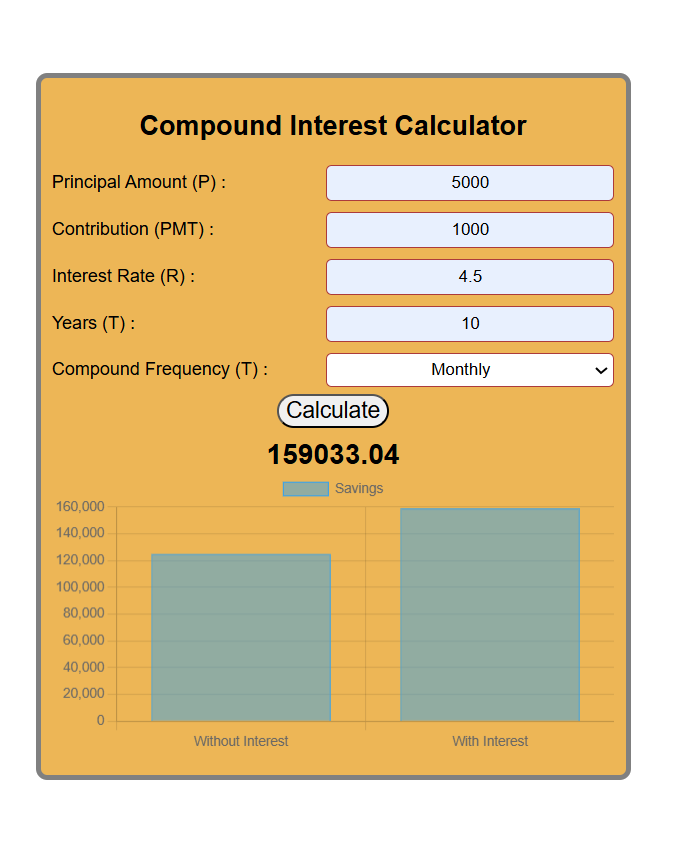

# 💰 Compound Interest Calculator

A sleek and interactive **Compound Interest Calculator** built using **HTML, CSS, and JavaScript**, designed to help users visualize their savings growth over time through real-time calculations and graphical representation.

---

## 🚀 Features

✅ Calculate compound interest instantly  
✅ Dynamic bar graph comparing **"Without Interest"** vs **"With Interest"**  
✅ Clean and modern UI  
✅ Real-time updates on user input  
✅ Responsive layout for desktop and mobile  
✅ Adjustable compound frequency (Monthly, Quarterly, Yearly)

---

## 📘 Formula Used

\[
A = P(1 + r/n)nt + PMT((1 + r/n)nt - 1)/(r/n)
\]

Where:
- **P** = Principal amount  
- **PMT** = Monthly contribution  
- **r** = Annual interest rate (decimal)  
- **n** = Compounding frequency per year  
- **t** = Time in years  

---

## 🧩 Project Structure

```
Compound-Interest-Calculator/
│
├── index.html        # Main interface
├── style.css         # Styling & layout
└── script.js         # Logic and Chart.js integration
```

---

## 🧠 How It Works

1. User inputs principal, contribution, rate, and time.
2. JavaScript calculates the **final compounded amount**.
3. The graph (powered by **Chart.js**) dynamically updates.
4. Comparison is shown between **simple accumulation** and **compounded growth**.

---

## 💻 How to Run

1. Clone the repository:
   ```bash
   git clone https://github.com/Amaan056/Compound-Interest-Calculator.git
   ```

2. Open the folder:
   ```bash
   cd Compound-Interest-Calculator
   ```

3. Run the app:
   - Simply double-click `index.html`  
   - or open it using a local live server (like VS Code Live Server extension)

---

## 📊 Preview



---

## 🧭 Future Improvements

- Add Dark/Light mode toggle 🌗  
- Include currency format customization (₹, $, €)  
- Add responsive charts and animations  
- Implement user data persistence using Local Storage  
- Deploy as a PWA (Progressive Web App)

---

## 🤝 Contributing

Contributions are welcome!  
If you’d like to improve the UI, add new features, or optimize code — fork the repo and make a pull request.

---

## 🧑‍💻 Author

**Mohd Amaan**  
📍 Lords Institute of Engineering & Technology  
🏆 SIH 2024 Finalist | Hackathon Winner | Passionate Web Developer  

🔗 [GitHub Profile](https://github.com/Amaan056)

---

## 📄 License

This project is licensed under the **MIT License** — feel free to use, modify, and distribute it freely.

---

⭐ **If you found this project useful, give it a star on GitHub!**
